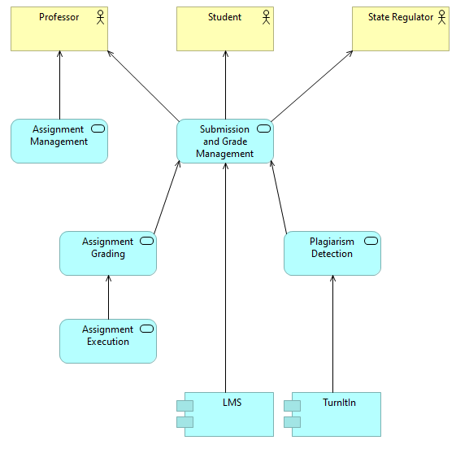
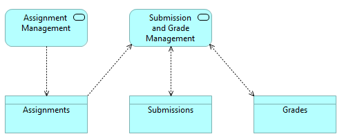

# Creating a Single Page Overview

# Summary

> **_Summary_:** An elevator pitch highlighting who the feature is for, what it does, and why it is required. 

TODO

# Stakeholders

> **_Stakeholders_:** A stakeholder map should highlight who has input or is interested in the evolution of the feature. Always prefer names over roles, but preferrably list both.

| Stakeholder   | Who  | Interest |
| ------------- | ---- | -------- |
| Product Owner | Head of Department | Owns the functional and many of the non-functional requirements of the solution. |
| Security Representative | CIO | Owns the risk relating to IT security, and related non-functional requirements. |
| Service Representative | Head of IT | Owns operating the system and performing day to day maintaince tasks. |
| Support Representative | Head of IT | Owns supporting and maintaining the system. |
| Test Representative | | Owns verification and acceptance of implementation against requirements. |
| Subject Matter Expert - User | Professor | Will be using the system to set assignments. |

# Requirements

> **_Requirements_:** Document your initial understanding of the requirements in a simple list or table.

# Functional Requirements 
* Students must be able to upload their source code for execution and grading.
* Grades and runs must be persistent and audit-able.
* Plagiarism detection must be performed by comparing other submissions and submitting to TurnItIn.
* Integration required with the University's learning management system (LMS)
* Professor must be able to set due date and time, after which submissions are rejected
* students can submit as many attempts as they want to improve their grade
* professors determine grading criteria, which may include metrics and/or tests
* Must support 300+ users.

# 10,000ft Overview

> **_10,000 Ft Overview_:** Create a 10,000 ft overview of what the feature provides and where it fits into the landscape. _This does not have to be "correct"_.  If the feature is a replacement or modification of an existing feature, include the "as is" and the "to be".  Regardless of notation, consider the C4 model - and remain at C1.

# Information Overview

> **_Information Overview_:** Create a high level information architecture.  Note: Depending on the complexity of the model, a more detailed domain model may be appropriate.

